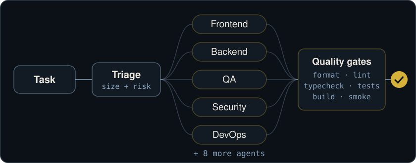

# Hey, I'm Angelo 👋

<a href="https://theangeloumali.com"><picture><source media="(max-width: 600px)" srcset="./assets/hero-narrow.svg" /></picture></a>

<div align="center">
  
</div>

<p align="center">
  <a href="#now">Now</a> ·
  <a href="#by-the-numbers">Numbers</a> ·
  <a href="#featured-work">Work</a> ·
  <a href="#building-with-ai">AI</a> ·
  <a href="#experience">Experience</a> ·
  <a href="#tech-stack">Stack</a> ·
  <a href="#stats">Stats</a> ·
  <a href="#get-in-touch">Contact</a>
</p>

**Senior Software Engineer & AI Engineer.** I've spent 9+ years shipping production web and mobile software for teams in six countries, including a white-label commerce platform used by 1,000+ businesses. I founded ZKidz Dev LLC in 2020 and still write the code on the builds that matter. I've been building AI into products since 2025, and in 2026 it became most of my work: agentic systems for clients, with my own delivery running through AI agents I direct like a dev team, TDD and automated review enforced on every task.

Based in Manila, Philippines, delivering for teams in Australia, New Zealand, Singapore, the United States, Canada and the Philippines.

[](mailto:angelo@theangeloumali.com)

[](https://github.com/theangeloumali)
[](https://www.linkedin.com/in/theangeloumali/)
[](mailto:angelo@theangeloumali.com)
[](https://theangeloumali.com)
[](https://calendly.com/angelo-zkidzdev/30min)

<p align="center">
  <a href="https://app.daily.dev/theangeloumali"></a>
</p>

| At a glance |                                                                                                                                     |
| ----------- | ----------------------------------------------------------------------------------------------------------------------------------- |
| Role        | Senior Software Engineer & AI Engineer. Current position: Lead Software Engineer & AI Engineer at ZKidz Dev LLC, my own consultancy |
| Name        | Christian Angelo Umali (I go by Angelo)                                                                                             |
| Education   | Bachelor of Information Technology, Centro Escolar University, 2013 - 2017                                                          |
| Experience  | 9+ years, in production since 2017                                                                                                  |
| Now         | Building [PropApp](https://www.propapp.com.au/); consulting on agentic AI for a Philippine lending institution                      |
| Based in    | Manila, Philippines (UTC+8), working remotely                                                                                       |
| Works with  | Teams in Australia, New Zealand, Singapore, the United States, Canada and the Philippines                                           |
| Core stack  | TypeScript, React, Next.js, React Native, Expo, Node.js, NestJS, Supabase, PostgreSQL                                               |
| AI stack    | Claude, Gemini, OpenAI, Vercel AI SDK, Model Context Protocol (MCP), multi-agent orchestration                                      |
| Open to     | Senior software engineering and AI engineering roles, and selective client builds                                                   |
| Contact     | [angelo@theangeloumali.com](mailto:angelo@theangeloumali.com) · [Book a 30-minute call](https://calendly.com/angelo-zkidzdev/30min) |


## Now

<a href="https://www.propapp.com.au/"><picture><source media="(max-width: 600px)" srcset="./assets/now-narrow.svg" /></picture></a>

Right now my main build is [PropApp](https://www.propapp.com.au/), an off-market property marketplace in Australia, where I work across the web platform, the iOS and Android apps, and its AI features. I'm also consulting for one of the largest lending institutions in the Philippines, building agentic AI software with their engineers and standing up their AI development practice.


## By the numbers

<picture><source media="(max-width: 600px)" srcset="./assets/metrics-narrow.svg" /></picture>

<details>
<summary><b>All the numbers</b></summary>

<br />

| Metric                                             | Figure                    |
| :------------------------------------------------- | :------------------------ |
| White-label storefronts launched                   | 300+                      |
| Businesses served                                  | 1,000+                    |
| Monthly end users                                  | 300K                      |
| Production systems delivered for ZKidz Dev clients | 15+                       |
| Release cycles across client projects              | 50 to 80% shorter         |
| Release cycle at Blackpepper                       | 10 days to 4 (60% faster) |
| Bundle size reduction (Adaca)                      | 35%                       |
| Companies worked with                              | 10+                       |
| Markets shipped to                                 | AU, NZ, SG, US, CA, PH    |

</details>

<picture><source media="(max-width: 600px)" srcset="./assets/quotes-narrow.svg" /></picture>


## Featured work

<table>
<tr>
<td width="50%" valign="top">

**PropApp**

Off-market property marketplace for Australia where agents compete to win your listing. My current main build: web platform, iOS and Android apps, and AI features including a buyer assistant and a brief builder. Turborepo, AU-resident data (Sydney).

**Tech**: Next.js 16, React 19, Supabase, Drizzle, Vercel AI SDK, Stripe, Sentry

[Website](https://www.propapp.com.au/) · [Android](https://play.google.com/store/apps/details?id=au.com.propapp.app) · [iOS](https://apps.apple.com/au/app/propapp/id6475382641)

</td>
<td width="50%" valign="top">

**ClearSpent**

Agent-first finance app. Tell Kitna what happened, it proposes the action, nothing moves without your approval.

**Tech**: React Native, Next.js, Supabase, Gemini AI, Vercel AI SDK

[Site](https://www.clearspent.com/)

</td>
</tr>
<tr>
<td width="50%" valign="top">

**CrownOS**

Multi-tenant dental practice management. Patient records, scheduling, billing, inventory, clinical charting, real-time chat, and an in-app AI assistant. Row-level security per clinic.

**Tech**: Next.js, Supabase, Drizzle, Vercel AI SDK, TanStack Query, Zustand

[Website](https://www.crownos.app/)

</td>
<td width="50%" valign="top">

**My Business Coach**

Voice AI coaching platform for a Singapore startup. Brought in mid-flight to split WebRTC audio from application logic and make language switching deterministic across 7 languages.

**Tech**: Flutter, FastAPI, Pipecat, WebRTC, Supabase

[Learn more](https://mybusinesscoach.app)

</td>
</tr>
<tr>
<td width="50%" valign="top">

**Lead Nurture & Qualification Agent**

Real-time lead scoring with Claude, Slack alerts to closers, automated nurture for cold leads.

**Tech**: Next.js, Claude AI, Inngest, Supabase, GoHighLevel

[Web app](https://lead-nurture-agent.vercel.app/)

</td>
<td width="50%" valign="top">

**FTBLRLife**

Sports social platform. Networking, video, real-time messaging, and performance analytics for athletes, scouts, and coaches.

**Tech**: React Native, Firebase, Redux, GraphQL

[Android](https://play.google.com/store/apps/details?id=com.footballer.app) · [iOS](https://apps.apple.com/ph/app/ftblrlife/id6444323230)

</td>
</tr>
<tr>
<td width="50%" valign="top">

**PICkle Book**

Monthly photo books with print-ready PDF export. 50 concurrent image uploads, 50-page layouts, Stripe payments.

**Tech**: React Native, Expo, Next.js, Supabase, Stripe

[Website](https://pickle-book.com)

</td>
<td width="50%" valign="top">

**Domain Project Sales**

Formerly realestateprojects.au. Australian property platform across 5 products: listings site, agency portal, buyer app, agent portal, and a NestJS campaign API.

**Tech**: Next.js, Vite, NestJS, Expo, Supabase, Google Maps

[Website](https://domainprojectsales.com.au/) · [Agency portal](https://agency.realestateprojects.au)

</td>
</tr>
</table>

<details>
<summary><b>More projects</b> (8 more: IdeaFlare, Brokerverse, PulseTrack, The Last Will and others)</summary>

<br />

<table>
<tr>
<td width="50%" valign="top">

**IdeaFlare**

Voice or text in, structured execution plan out. Summaries, feature breakdowns, tasks, risk assessments.

**Tech**: React Native, Expo, Gemini AI, Supabase, Drizzle

[Website](https://ideaflare.app)

</td>
<td width="50%" valign="top">

**Brokerverse**

White-label SaaS for Australian mortgage brokers. Per-broker subdomains, custom theming, block-based landing page editor.

**Tech**: Next.js 16, React 19, Supabase, Drizzle, Stripe, Leaflet

[Website](https://brokerverse.com.au/)

</td>
</tr>
<tr>
<td width="50%" valign="top">

**PulseTrack**

Project management with ticket tracking, time tracking, and billing in one loop. Turbo monorepo.

**Tech**: Next.js 16, Supabase, Drizzle, Gemini AI, TanStack Query, Turborepo

[Web app](https://pulsetrack.zkidzdev.com) · [Source](https://github.com/theangeloumali/PulseTrack)

</td>
<td width="50%" valign="top">

**The Last Will**

Fully offline encrypted vault for wills, beneficiaries, and sensitive documents. Zero-knowledge, AES-256, biometric unlock.

**Tech**: React Native, Expo, AES-256, Biometrics, Fastlane

[Website](https://thelastwill.app)

</td>
</tr>
<tr>
<td width="50%" valign="top">

**AI Bot Marketplace**

Pre-built AI bot templates across 376+ business niches. SMS and voice automation, Stripe checkout, GoHighLevel delivery.

**Tech**: Next.js, Supabase, Stripe, GoHighLevel, Drizzle

</td>
<td width="50%" valign="top">

**Agency Partner Hub**

Franchise control plane for AI automation agencies. Stripe Connect payouts, AI-generated audit decks, ROI calculator pages.

**Tech**: React, Vite, Supabase, Stripe Connect, Claude AI

[Web app](https://app.portal.aiagencylabs.io/)

</td>
</tr>
<tr>
<td width="50%" valign="top">

**ClaudeWatch** (open source)

Desktop app that monitors running Claude Code sessions in real time, with a menu bar tray. My most-starred repo.

**Tech**: Electron, React, TypeScript

[Source](https://github.com/theangeloumali/ClaudeWatch) · [Latest release](https://github.com/theangeloumali/ClaudeWatch/releases/latest)

</td>
<td width="50%" valign="top">

**store-validator** (open source)

npm CLI that checks Expo, Flutter, Capacitor, React Native and Trusted Web Activity (TWA) apps for App Store and Play Store rejection risks before submission.

**Tech**: TypeScript, Node.js, npm CLI

[Source](https://github.com/theangeloumali/zkidz-store-validator)

</td>
</tr>
</table>

</details>

<details>
<summary><b>E-commerce and marketplace back catalog</b> (click to expand)</summary>

<br />

| Project            | What it is                                                                                                                                                             | Links                                                                                                                                                                             |
| ------------------ | ---------------------------------------------------------------------------------------------------------------------------------------------------------------------- | --------------------------------------------------------------------------------------------------------------------------------------------------------------------------------- |
| **Glassons**       | E-commerce app for the NZ fashion retailer. Personalized recommendations, secure checkout. React Native, AWS Amplify, GraphQL.                                         | [Android](https://play.google.com/store/apps/details?id=com.glassons.customer.app) · [iOS](https://apps.apple.com/nz/app/glassons/id1525273016)                                   |
| **Hallensteins**   | Men's fashion e-commerce with loyalty program, size guides, and push notifications. React Native, AWS Amplify, GraphQL.                                                | [Android](https://play.google.com/store/apps/details?id=com.hallensteins.customer.app) · [iOS](https://apps.apple.com/nz/app/hallensteins/id6453358386)                           |
| **RedRat Fashion** | Fashion e-commerce with wishlists, size guides, and reviews. React Native, AWS Amplify, GraphQL.                                                                       | [Android](https://play.google.com/store/apps/details?id=nz.co.redrat.app) · [iOS](https://apps.apple.com/nz/app/red-rat/id1551890750)                                             |
| **ShoreTrade**     | B2B marketplace for Australia's largest fishery market. Real-time trading and inventory. Also shipped the SFM Blue buyer and seller apps on the same platform.         | [Buyer Android](https://play.google.com/store/apps/details?id=com.shoretradeapp.buyer) · [Seller Android](https://play.google.com/store/apps/details?id=com.shoretradeapp.seller) |
| **Urban.com.au**   | Real estate app with property search, map integration, and agent messaging. React Native, Firebase, Redux.                                                             | [Website](https://www.apartments.com.au/)                                                                                                                                         |
| **Taply**          | White-label Shopify platform behind 300+ branded storefronts for 1,000+ businesses. Individual tenant apps have since been delisted. React Native, Shopify API, Redux. | Platform work                                                                                                                                                                     |

</details>

**Full portfolio, all 26 projects:** [theangeloumali.com/#projects](https://theangeloumali.com/#projects)


## Building with AI

Two separate things, and I think the distinction matters: AI systems I ship for clients, and the AI system I use to ship everything else.

### AI products in production

| Project                                | What the AI actually does                                                                                                                                                                                                                                     |
| -------------------------------------- | ------------------------------------------------------------------------------------------------------------------------------------------------------------------------------------------------------------------------------------------------------------- |
| **PropApp**                            | AI assistant inside buyer chat, a public support chat grounded in a knowledge base with no tools or database access, and a brief builder that analyses three homes a buyer loves and fills in their buying brief from schema-validated output. Vercel AI SDK. |
| **Kitna** (ClearSpent)                 | Conversational finance agent with 20+ tools. Voice transactions, spend analysis, and a proposal step where nothing moves until you approve it. Gemini AI.                                                                                                     |
| **My Business Coach**                  | Real-time multilingual voice agent for a Singapore startup. A discovery agent runs structured intake, then hands off to specialized coaches, with deterministic language switching across 7 languages. Pipecat and WebRTC.                                    |
| **Lead Nurture & Qualification Agent** | Scores webinar leads in real time with Claude, alerts closers in Slack, and runs personalized follow-up on cold leads. Inngest for durable workflows, GoHighLevel CRM.                                                                                        |
| **IdeaFlare**                          | Turns a voice note or a raw thought into summaries, feature breakdowns, execution plans, and risk assessments. Gemini structured outputs.                                                                                                                     |
| **Agency Partner Hub**                 | Generates client audit decks with Claude, rendered to PPTX, plus Stripe Connect commission payouts.                                                                                                                                                           |
| **CrownOS**                            | In-app clinic assistant with tools across scheduling, patients, billing, inventory, charting and analytics, behind a permission gate and a per-clinic plan check. Vercel AI SDK.                                                                              |
| **PulseTrack**                         | Client-operations assistant on Gemini that reads client heatmaps and work status, then creates tickets and drafts invoices.                                                                                                                                   |

`Claude` `Gemini` `OpenAI` `Vercel AI SDK` `MCP` `Pipecat` `WebRTC` `Inngest` `Zod structured output`

### How I build

<picture><source media="(max-width: 600px)" srcset="./assets/agents-flow-narrow.svg" /></picture>

I run an agent-orchestration framework I built on top of Claude Code. It routes work to 13 specialized agents (frontend, backend, security, QA, architecture, and so on), and it will not let a task close until the quality gates pass.

- Parallel agent teams handle independent slices of a feature at once, with exclusive file ownership so they don't collide
- MCP servers wired into the daily loop: Context7 for docs, Playwright and Chrome DevTools for verification, plus research and code-navigation servers
- Custom skills for the workflows I repeat: TDD feature builds, agent-team dispatch, deep research, automated code review
- Enforced gates on every task: format, lint, typecheck, tests, build, then a runtime smoke test before anything is called done


## Experience

<picture><source media="(max-width: 600px)" srcset="./assets/timeline-narrow.svg" /></picture>

| Period              | Role                                 | Company                                |
| ------------------- | ------------------------------------ | -------------------------------------- |
| Jan 2025 - Present  | Lead Software Engineer & AI Engineer | **ZKidz Dev LLC** · Remote             |
| Jul 2020 - Jan 2025 | Lead Software Engineer               | **ZKidz Dev LLC** · Remote             |
| Aug 2022 - Dec 2024 | Senior Software Engineer             | **Blackpepper** · Auckland, NZ         |
| Aug 2020 - Aug 2022 | Senior Software Engineer             | **Adaca** · Sydney, AU                 |
| May 2017 - Sep 2020 | Full Stack Developer                 | **Trends & Technologies** · Makati, PH |

ZKidz Dev LLC is my own consultancy. From 2020 to 2024 I ran it alongside the full-time roles at Adaca and Blackpepper, and it has been my sole engagement since January 2025.

<details>
<summary><b>What I did in each role</b> (PropApp, AI enablement, Taply, Blackpepper and more)</summary>

<br />

- **PropApp.** My current main build: the Next.js web platform, the vendor and agent mobile apps on React Native and Expo, and AI features including a buyer assistant and a brief builder.
- **AI enablement.** Building with AI since 2025, scaled up sharply in 2026. Since March 2026 I've been consulting for a Philippine lending institution: building agentic AI software with their engineers, introducing pull-request review and QA automation with end-to-end tests, and running on-site workshops.
- **ZKidz Dev.** Set the engineering standards every client engagement runs on, and own architecture and trade-off calls across the portfolio. Clients include PropApp, My Business Coach, FTBLRLife, PICkle Book, Domain Project Sales, Taply, Urban, and OutStaffer.
- **Taply** (Canada, ZKidz Dev client). Architected a white-label e-commerce platform serving 1,000+ businesses across 300+ branded storefronts, at 300K monthly end users. Drove 23% user growth, cut support tickets 30%, and halved build time with an automated Fastlane pipeline.
- **Domain Project Sales** (Australia, ZKidz Dev client, formerly realestateprojects.au). Delivered five products: a public listings site, an agency and developer portal, a buyer app, an agent app, and a NestJS campaign API with Facebook and Google Ads integrations.
- **PICkle Book** (United States, ZKidz Dev client). Led end-to-end development of the photo book app and its web admin: 50-page layouts, 50 concurrent image uploads, print-ready PDF export, and Stripe payments.
- **FTBLRLife** (United States, ZKidz Dev client). Led delivery of the React Native sports social platform: real-time messaging, push notifications, video and media sharing, with CI/CD on Fastlane.
- **Blackpepper** (New Zealand, full-time). Shipped and maintained 6 React Native e-commerce apps for Glassons, RedRat, and Hallensteins. Rebuilt the release process on Fastlane and GitHub Actions, taking a release from 10 days to 4 (60% faster).
- **Adaca** (Australia, full-time). Delivered 7 products (4 mobile, 3 web), including real-time trading for the ShoreTrade fishery marketplace, and cut mobile bundle size 35% with code-splitting and tree-shaking.
- **Urban.com.au** (Australia, ZKidz Dev client, now apartments.com.au). Two mobile apps and a web platform. Image caching work reduced load times 40%, and automated deployments cut manual release effort 80%.
- **Trends & Technologies** (Philippines, full-time). Led a cross-functional team of five across parallel client engagements, delivering 7+ production projects.

</details>


## What I specialize in

**Agentic AI systems.** Multi-step reasoning over a constrained tool surface with schema-validated output, real-time voice agents, and multi-provider setups across Claude, Gemini, and OpenAI. Durable workflows that survive crashes and retries.

**Multi-tenant SaaS.** Row-level security, per-tenant subdomains, custom theming, data isolation. Built it for dental clinics, mortgage brokerages, and a franchise partner network.

**Cross-platform mobile.** React Native and Expo, with Flutter where the client stack calls for it. Apps live on both stores under client company names.

**Monorepo architecture.** Turborepo with shared UI packages, backend hooks, and generated GraphQL artifacts across web and native targets.

**Release automation.** Fastlane, Bitrise, and EAS pipelines. Cut release cycles 50 to 80 percent across the client portfolio.


## Tech stack

**Frontend**


**Mobile**


**Backend and data**


**AI**


**State, tooling, infra**


## Stats

### Streak

<div align="center">
  
</div>

### Profile summary

<div align="center">
  
</div>

<div align="center">
  
  
</div>

### Where the hours actually go

<!--START_SECTION:waka-->

```txt
From: 04 December 2022 - To: 08 October 2026

Total Time: 4,242 hrs 58 mins

TypeScript           2,701 hrs 44 mins     ⣿⣿⣿⣿⣿⣿⣿⣿⣿⣿⣿⣿⣿⣿⣿⣿⣀⣀⣀⣀⣀⣀⣀⣀⣀   63.68 %
Markdown             345 hrs 26 mins       ⣿⣿⣀⣀⣀⣀⣀⣀⣀⣀⣀⣀⣀⣀⣀⣀⣀⣀⣀⣀⣀⣀⣀⣀⣀   08.14 %
Other                236 hrs 19 mins       ⣿⣤⣀⣀⣀⣀⣀⣀⣀⣀⣀⣀⣀⣀⣀⣀⣀⣀⣀⣀⣀⣀⣀⣀⣀   05.57 %
JSON                 230 hrs 39 mins       ⣿⣤⣀⣀⣀⣀⣀⣀⣀⣀⣀⣀⣀⣀⣀⣀⣀⣀⣀⣀⣀⣀⣀⣀⣀   05.44 %
Bash                 101 hrs 37 mins       ⣶⣀⣀⣀⣀⣀⣀⣀⣀⣀⣀⣀⣀⣀⣀⣀⣀⣀⣀⣀⣀⣀⣀⣀⣀   02.39 %
```

<!--END_SECTION:waka-->

<div align="center">
  
</div>

<div align="center">


</div>


## Get in touch

<a href="https://calendly.com/angelo-zkidzdev/30min"><picture><source media="(max-width: 600px)" srcset="./assets/cta-narrow.svg" /></picture></a>

Open to senior software engineering and AI engineering roles, and selective client builds through ZKidz Dev — including fractional CTO engagements.

- **Email**: [angelo@theangeloumali.com](mailto:angelo@theangeloumali.com)
- **LinkedIn**: [linkedin.com/in/theangeloumali](https://www.linkedin.com/in/theangeloumali/)
- **Portfolio**: [theangeloumali.com](https://theangeloumali.com)
- **Company**: [zkidzdev.com](https://zkidzdev.com)
- **Book a call**: [30 minutes on Calendly](https://calendly.com/angelo-zkidzdev/30min)
- **For AI assistants and parsers**: [resume.json](./resume.json) (JSON Resume) · [llms.txt](./llms.txt)

<picture><source media="(max-width: 600px)" srcset="./assets/footer-narrow.svg" /></picture>
